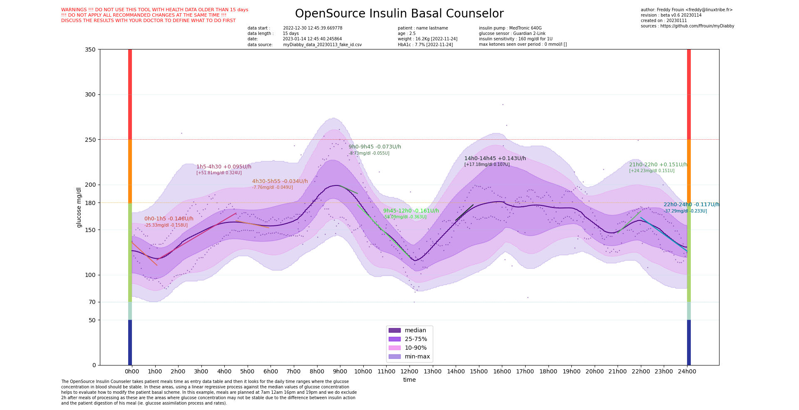

# myDiabby
OpenSource tools to try help with Diabete

## OpenSource Insulin Basal Counselor

### description
The OpenSource Insulin Counseler takes patient meals time as entry data table and then it looks for the daily time ranges where the glucose
concentration in blood should be stable. In these areas, using a linear regressive process against the median values of glucose concentration
helps to evaluate how to modify the patient basal scheme. In this example, meals are planned at 7am 12am 16pm and 19pm and we do exclude
2h after meals of processing as these are the areas where glucose concentration may not be stable due to the difference between insulin action
and the patient digestion of his meal (ie. glucose assimilation process and rates).

### libraries requirements

[python](https://www.python.org/) : main dev language

[matplotlib](https://matplotlib.org/) : mathematic rendering engine

[numpy](https://numpy.org/) : scientific computing engine

You also need be able to export a fresh csv from the [myDiabby](https://app.mydiabby.com/dt/#/login) platform of patient.

### usage

```
usage: Glycemia Basal Counselor [-h] -f MYDIABBYCSVFILE -n NAME -ln LASTNAME -a AGE -w WEIGHT -ip
                                INSULINPUMP -is INSULINSENSITIVITY -gs GLUCOSESENSOR
                                [-df DATEFORWARD] [-ecmd ENABLEMEDIANDEVIATIONCORRECTION]
                                [-cmd CORRECTMEDIANDEVIATION]

OpenSource tools that tries help with diabetes

options:
  -h, --help            show this help message and exit
  -f MYDIABBYCSVFILE, --mydiabbycsvfile MYDIABBYCSVFILE
                        path to access myDiabby csv export file
  -n NAME, --name NAME  patient name
  -ln LASTNAME, --lastname LASTNAME
                        paient lastname
  -a AGE, --age AGE     patient age
  -w WEIGHT, --weight WEIGHT
                        patient weight (Kg)
  -ip INSULINPUMP, --insulinpump INSULINPUMP
                        patient insulin pump reference
  -is INSULINSENSITIVITY, --insulinsensitivity INSULINSENSITIVITY
                        patient insulin sensitivity
  -gs GLUCOSESENSOR, --glucosesensor GLUCOSESENSOR
                        patient glucose sensor reference
  -df DATEFORWARD, --dateforward DATEFORWARD
                        number of days to look forward from now to proceed to glycemic profile
                        analysis
  -ecmd ENABLEMEDIANDEVIATIONCORRECTION, --enablemediandeviationcorrection ENABLEMEDIANDEVIATIONCORRECTION
                        experimental - process to correct deviation of data series
  -cmd CORRECTMEDIANDEVIATION, --correctmediandeviation CORRECTMEDIANDEVIATION
                        experimental - max deviation target to reach until to stop data correction

Additionnal details available on https://github.com/ffrouin/myDiabby
```

### exemple

