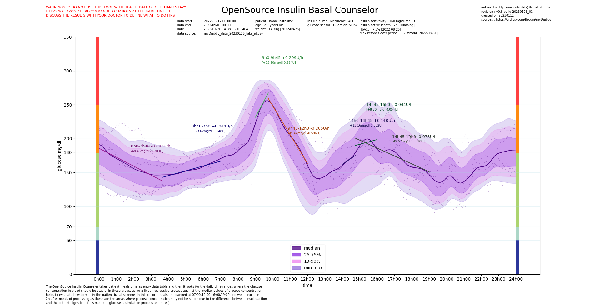
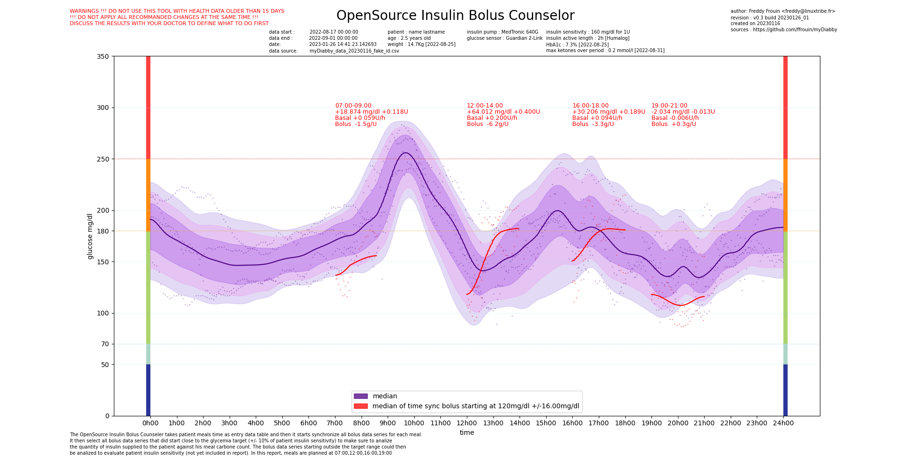

# myDiabby
OpenSource tools to try help with Diabete

The toolkit actually is based on two tools :
  - the basal counselor : for basal scheme changes
  - the bolus counselor : to adjust basal and/or bolus ratio of meals

## Requirements

### libraries

[python](https://www.python.org/) : main dev language

[matplotlib](https://matplotlib.org/) : mathematic rendering engine

[numpy](https://numpy.org/) : scientific computing engine

### data

[myDiabby](https://app.mydiabby.com/dt/#/login) to extract health data of patient as a csv file

## OpenSource Insulin Basal Counselor

### description
The OpenSource Insulin Basal Counseler takes patient meals time as entry data table and then it looks for the daily time ranges where the glucose
concentration in blood should be stable. In these areas, using a linear regressive process against the median values of glucose concentration
helps to evaluate how to modify the patient basal scheme. In this example, meals are planned at 7am 12am 16pm and 19pm and we do exclude
2h after meals of processing as these are the areas where glucose concentration may not be stable due to the difference between insulin action
and the patient digestion of his meal (ie. glucose assimilation process and rates).

### usage

```
usage: glycemia_basal_counselor.py [-h] -f MYDIABBYCSVFILE -n NAME -ln LASTNAME -a AGE -m MEALS
                                   [-ip INSULINPUMP] -u UNIT [-is INSULINSENSITIVITY]
                                   [-ir INSULINREFERENCE] -il INSULINACTIVELENGTH
                                   [-gs GLUCOSESENSOR] [-df DATEFORWARD] [-sd STARTDATE]

OpenSource tools that tries help with diabetes

options:
  -h, --help            show this help message and exit
  -f MYDIABBYCSVFILE, --mydiabbycsvfile MYDIABBYCSVFILE
                        path to access myDiabby csv export file
  -n NAME, --name NAME  patient name
  -ln LASTNAME, --lastname LASTNAME
                        paient lastname
  -a AGE, --age AGE     patient age
  -m MEALS, --meals MEALS
                        time list of patient meals. Syntax is "07:00,12:00,16:00,19:00"
  -ip INSULINPUMP, --insulinpump INSULINPUMP
                        patient insulin pump reference
  -u UNIT, --unit UNIT  mg/dl, mmol/L
  -is INSULINSENSITIVITY, --insulinsensitivity INSULINSENSITIVITY
                        patient insulin sensitivity
  -ir INSULINREFERENCE, --insulinreference INSULINREFERENCE
                        patient insulin reference
  -il INSULINACTIVELENGTH, --insulinactivelength INSULINACTIVELENGTH
                        patient insulin active length in seconds. Default is 2h (7200)
  -gs GLUCOSESENSOR, --glucosesensor GLUCOSESENSOR
                        patient glucose sensor reference
  -df DATEFORWARD, --dateforward DATEFORWARD
                        number of days to look forward from now to proceed to glycemic profile
                        analysis
  -sd STARTDATE, --startdate STARTDATE
                        date to start analyze with, now() by default or YYYY/MM/DD

Additionnal details available on https://github.com/ffrouin/myDiabby
```

### exemple


## OpenSource Insulin Bolus Counselor
The OpenSource Insulin Bolus Counseler takes patient meals time as entry data table and then it starts synchronize all bolus data series for each meal.
It then select all bolus data series that did start close to the glycemia target (+/- 10% of patient insulin sensitivity) to make sure to analize
the quantity of insulin supplied to the patient against his meal carbone count. The bolus data series starting outside the target range could then
be analized to evaluate patient insulin sensitivity (not yet included in report).

### usage
```
usage: glycemia_bolus_counselor.py [-h] -f MYDIABBYCSVFILE -n NAME -ln LASTNAME -a AGE -m MEALS
                                   [-ip INSULINPUMP] -u UNIT [-is INSULINSENSITIVITY]
                                   [-gt GLYCEMIATARGET] [-ir INSULINREFERENCE]
                                   [-il INSULINACTIVELENGTH] [-gs GLUCOSESENSOR] [-df DATEFORWARD]
                                   [-sd STARTDATE]

OpenSource tools that tries help with diabetes

options:
  -h, --help            show this help message and exit
  -f MYDIABBYCSVFILE, --mydiabbycsvfile MYDIABBYCSVFILE
                        path to access myDiabby csv export file
  -n NAME, --name NAME  patient name
  -ln LASTNAME, --lastname LASTNAME
                        paient lastname
  -a AGE, --age AGE     patient age
  -m MEALS, --meals MEALS
                        time list of patient meals. Syntax is "07:00,12:00,16:00,19:00"
  -ip INSULINPUMP, --insulinpump INSULINPUMP
                        patient insulin pump reference
  -u UNIT, --unit UNIT  mg/dl, mmol/L
  -is INSULINSENSITIVITY, --insulinsensitivity INSULINSENSITIVITY
                        patient insulin sensitivity
  -gt GLYCEMIATARGET, --glycemiatarget GLYCEMIATARGET
                        patient glycemia target
  -ir INSULINREFERENCE, --insulinreference INSULINREFERENCE
                        patient insulin reference
  -il INSULINACTIVELENGTH, --insulinactivelength INSULINACTIVELENGTH
                        patient insulin active length in seconds. Default is 2h (7200)
  -gs GLUCOSESENSOR, --glucosesensor GLUCOSESENSOR
                        patient glucose sensor reference
  -df DATEFORWARD, --dateforward DATEFORWARD
                        number of days to look forward from now to proceed to glycemic profile
                        analysis
  -sd STARTDATE, --startdate STARTDATE
                        date to start analyze with, now() by default

Additionnal details available on https://github.com/ffrouin/myDiabby
```

### exemple


